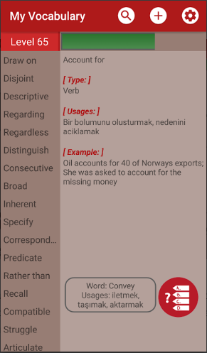
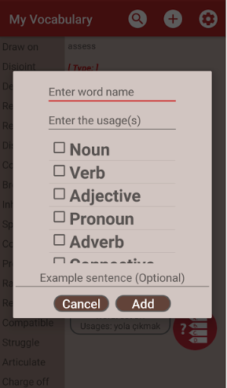
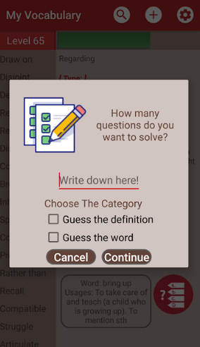
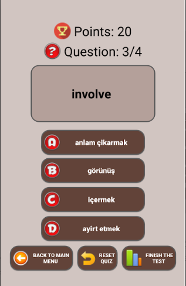
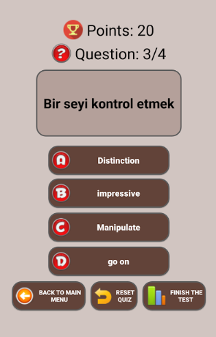
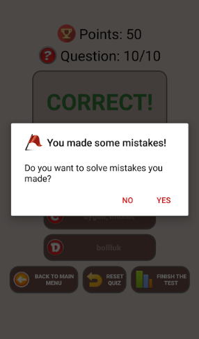

# MyVocabulary

• Bu uygulama, temelinde kullanıcın eklediği ingilizce kelimeleri baz alıyor. İsteğe bağlı olarak kelimeleri
ister ingilizce-ingilizce ister de ingilizce-türkçe olarak ekleyebiliyorsunuz. Eklenen kelimeler üzerinde,
çeşitli işlemler yapabiliyorsunuz. 

• Silme, düzenleme, arama yapma gibi temel işlemlerin yanı sıra test modu sayesinde eklenilen kelimelerin akılda sürekli
güncel kalınması sağlanıyor. Bu modda eklenen kelimeler belli öncelik değerleriyle seçilip, istenilen sayı kadar soru soruluyor.
Kullanıcı isterse, kelime verip, tanım soran modunu ya da tanım verip, o tanıma karşılık gelen kelime modunu kullanabiliyor.
Böylelikle kullanıcıya iki türlü pratik yapma imkanı sağlanıyor. Test çözerken hata yaptığınız kelimeleri tekrardan çözme fırsatı elde ediyorsunuz.

• Backup ve import fonksiyonlarıyla eklenen kelimelerin silinme, kaybolma riski minimum seviyede kalıyor. Yedeklenen kelimeleri içeren dosya,
ister SD kartlarında ,ister bilgisayarlarda saklayabiliyorsunuz.  Böylelikle kelime listenizi, istediğiniz
kadar genişletip, sorular çözüp, pratik yapabiliyorsunuz.
Aşağıda küçük bir demosunu izleyebilirsiniz.

Herhangi bir internet bağlantısına gerek duymadan, ücretsiz bir şekilde, istediğiniz zaman kelime pratiği yapma imkanına sahip oluyorsunuz.

